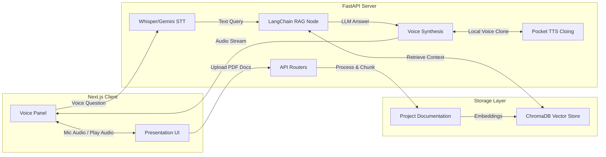

<div align="center">
  
  
  
  
  

  <br />
  <br />

  <h1>🎤 ConsultDeck Studio</h1>
  <strong>Open-Source RAG + Voice Q&A Presentation System</strong>
  <br />
  <br />
  
  [](https://opensource.org/licenses/MIT)
  [](https://fastapi.tiangolo.com)
  [](https://nextjs.org/)
  
  <p>
    Turn your dull slides into a <b>live AI expert</b>. Upload your project documentation (PDF) and your presentation slides, clone your voice, and let the system answer client questions via real-time Voice Q&A—fully context-aware!
  </p>
</div>

<hr />

## 🌟 Overview

**ConsultDeck Studio** bridges the gap between static presentations and dynamic, intelligent interactions. By combining Retrieval-Augmented Generation (RAG) with State-of-the-Art Speech-to-Text (Whisper/Gemini) and Text-to-Speech engines, your slides literally **talk back** to your audience.

Ideal for **Consultants, Developer Advocates, and Technical Sales Engineers** who want their system architecture and codebases instantly searchable and explainable during live client meetings.

### ✨ Key Features

| Feature | Description |
|---|---|
| 📄 **Document Indexing** | Upload your project documentation (PDF) → context is instantly vectorized and indexed to build your AI's knowledge base. |
| 🧠 **Slide-Scoped RAG** | Each slide acts as a localized context trigger, fetching highly relevant constraints from your codebase. |
| 🎤 **Bilingual Voice Input** | Talk to your presentation naturally! Powered by Whisper, it seamlessly understands both **English** and **Hindi/Hinglish**. |
| 🗣️ **Instant Voice Cloning** | Clone your own voice locally using **Pocket TTS**. Your AI avatar speaks directly to clients in your exact vocal tone! |
| 🔒 **Self-Hosted Privacy** | Operate locally with **Ollama** or deploy privately. Your proprietary documentation stays firmly within your infrastructure. |
| 🤖 **Model Agnostic** | Seamless integrations with OpenAI (GPT-4o), Anthropic (Claude 3.5), Google (Gemini), and local LLMs (Llama 3). |

---

## 🏗️ System Architecture



---

## 🚀 Getting Started

### Prerequisites

Ensure you have the following installed on your machine:
- **Node.js** (v18+)
- **Python** (3.10+)
- **Docker** & **Docker Compose** (Highly Recommended)
- Optional: HuggingFace Account (for Pocket-TTS voice cloning authorization)

### 1️⃣ Clone & Configure

```bash
git clone https://github.com/YOUR_USERNAME/slide_automation.git
cd slide_automation

# Setup environment variables
cp backend/.env.example backend/.env
```
👉 *Open `backend/.env` and configure your API keys (e.g., `OPENAI_API_KEY`, `GEMINI_API_KEY`).*

### 2️⃣ Fast Deployment (Docker)

The fastest and most reliable way to spin up both the frontend and backend.

```bash
docker compose up --build -d
```
Open your browser and navigate to `http://localhost:3000`.

### 3️⃣ Manual Installation (Local Dev)

If you prefer to run the services independently for development:

**Backend (Terminal 1):**
```bash
cd backend
python -m venv venv
source venv/bin/activate  # On Windows: venv\Scripts\activate
pip install -r requirements.txt
uvicorn main:app --reload --port 8000
```

**Frontend (Terminal 2):**
```bash
cd frontend
npm install
npm run dev
```
Navigate to `http://localhost:3000`.

---

## 🎯 Usage Flow

1. **Setup Session**: Open the Studio (`localhost:3000`), upload your project documentation (PDFs) and Presentation Slides (PPTX/PDF).
2. **Clone Voice (Optional)**: Click on the Voice Identity step, record a 10-second prompt, and the system matches your voice signature locally.
3. **Choose Theme & Provider**: Select your visual theme and preferred LLM Provider (Gemini / OpenAI / Anthropic / Ollama).
4. **Launch Presentation**: Hit launch! While presenting, you or the client can click the Mic button on the floating Voice Panel to ask questions contextually based on the active slide.

---

## 🔧 Configure AI Providers

Modify the `backend/.env` to switch between supported engines:

| Provider | STT Engine | TTS Engine | Best Used For |
|---|---|---|---|
| **OpenAI** | Whisper | OpenAI TTS-1 | Best out-of-the-box quality & speed |
| **Gemini** | Multimodal STT | Edge TTS (Fallback) | Extremely fast reasoning & free tier |
| **Anthropic**| Whisper | Edge TTS (Fallback) | Complex coding architecture queries |
| **Ollama** | Browser API | Browser API | Fully private, offline networking |

*(Note: Voice cloning overrides the TTS engine utilizing Local Pocket-TTS).*

---

## 🤝 Contributing

We welcome contributions! If you're looking to help out, here are a few areas we are actively working on:
- ElevenLabs direct integration
- Interactive real-time waveform visualizers for the Voice panel
- Full export of automated Q&A transcripts as PDF minutes

1. Fork the Project
2. Create your Feature Branch (`git checkout -b feature/AmazingFeature`)
3. Commit your Changes (`git commit -m 'Add some AmazingFeature'`)
4. Push to the Branch (`git push origin feature/AmazingFeature`)
5. Open a Pull Request

## 📄 License

Distributed under the MIT License. See `LICENSE` for more information.

---

<p align="center">
  <b>Built for consultants who want their slides to talk back.</b>
</p>
